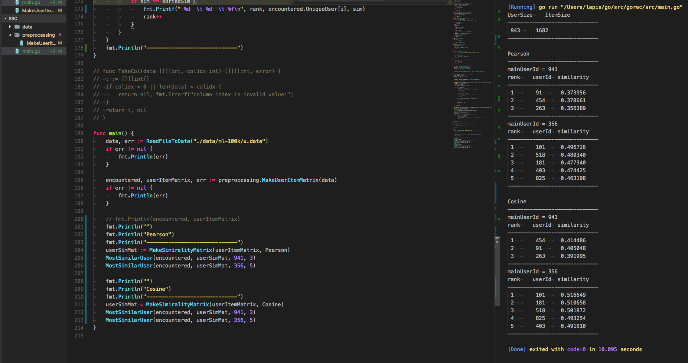

# GoRec


## Methods

- User base
    - Pearson Coef
    - Cosine
    - Jaccard
    - Dice
    - Simpson

## input data

ex) http://files.grouplens.org/papers/ml-100k.zip

```
user_id, item_id, rating
1, 2, 4
1, 127, 1
21, 63, 2
...
```


## Example

http://files.grouplens.org/papers/ml-100k.zip

### Download Data

```sh
$ cd gorec/src/data
$ sh ./download_data.sh
```

### Run App
```sh
$ cd gorec/src
$ go run main.go
```

### Output



### change main.go

You can change some parameter for getting similar user.

```go
userSimMatrix := MakesimilarityMatrix(userItemMatrix, method)
MostSimilarUser(encountered, userSimMatrix, userId, similarSize)
```
