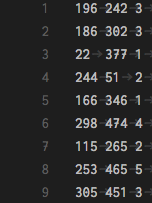

# GoRec

blog: https://lapis-zero09.hatenablog.com/entry/2018/05/06/171536

## Methods

- User/Item base
    - Pearson
    - Cosine
    - Adjusted Cosine
    - Jaccard
    - Dice
    - Simpson

## input data

```
user_id, item_id, rating
1, 2, 4
1, 127, 1
21, 63, 2
...
```
ex) http://files.grouplens.org/papers/ml-100k.zip




## Example

http://files.grouplens.org/papers/ml-100k.zip

### Download Data

```sh
$ cd gorec/src/data
$ sh ./download_data.sh
```

### Run App
```sh
$ cd gorec/src
$ go run main.go
```

### Output


### change main.go

You can change some parameter for getting similar user/item.

```go
// user
simMatrix := MakeSimilarityMatrix(userItemMatrix, method, userFlag=true)
MostSimilar(encountered.UniqueUser, simMatrix, userId, similarSize)

// item
simMatrix := MakeSimilarityMatrix(userItemMatrix, method, userFlag=false)
MostSimilar(encountered.UniqueItem, simMatrix, itemId, similarSize)
```
